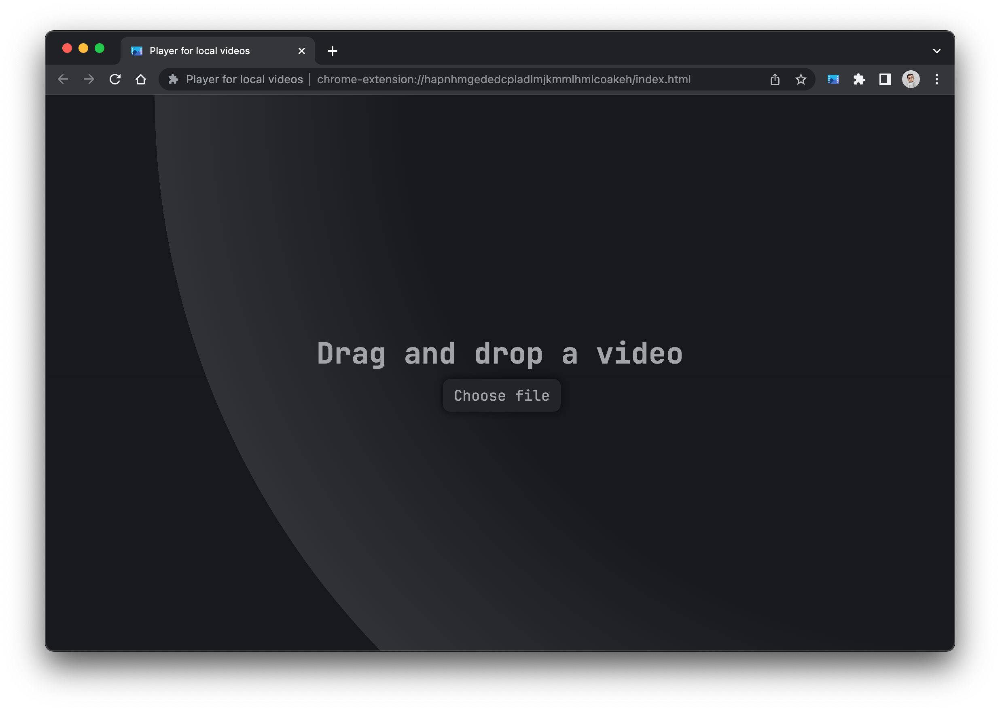

# Player for local videos
This a video player for local videos whose main features are:
* Light/dark theme (following system preferences)
* Restores video state[^note]
* [Keyboard shortcuts](#keyboard-shortcuts)
* Global Media Controls integration
* Works offline

Light mode | Dark mode
:---------:|:--------:
 | 
 | 

## Usage
To use the extension, click on its tooltip icon or press `Ctrl+Shift+O`[^1].

To open a video, drag and drop it on the extension page or click on the button. If another video is opened, its state will be saved and the dragged video will be opened.

## Keyboard shortcuts
The following keyboard shortcuts are supported:
| Key | Action |
|:---:|---|
| `Space` `k` | Toggle play/pause |
| `S` | Slow down by 0.1 |
| `D` | Speed up by 0.1 |
| `Z` `Left arrow` `Down arrow` | Rewind 10 seconds |
| `X` `Right arrow` `Up arrow` | Forward 10 seconds |
| `R` | Reset default speed |
| `T` | Toggle time/remaining |
| `A` | Set speed to 1.8 |
| `M` | Toggle mute |
| `C` | Toggle video zoom |
| `P` | Toggle PiP |
| `F` `Enter` | Toggle fullscreen |

[^note]: The video state is saved in the browser's local storage. If you clear your browser's data, the state will be lost. Saved state will be deleted upon video completion or for videos last played more than 30 days ago.

[^1]: `Cmd+Shift+O` on macOS. Customizable under `chrome://extensions/shortcuts`.
