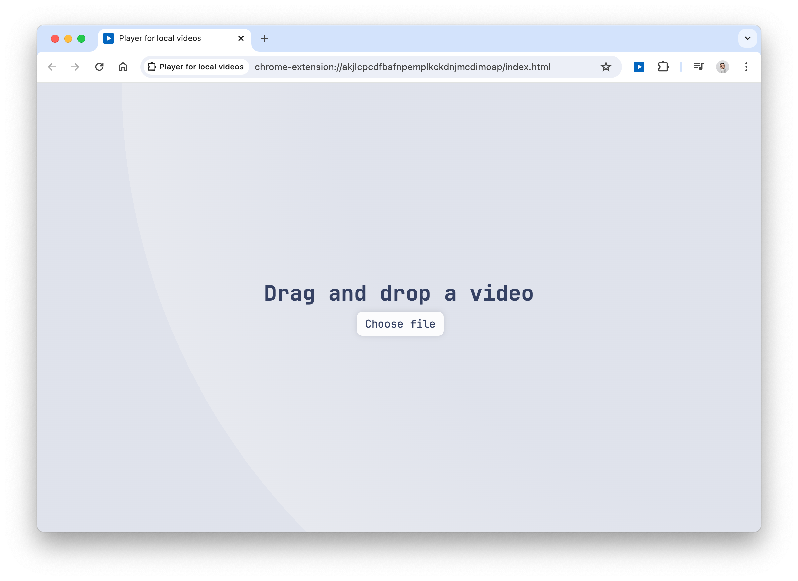
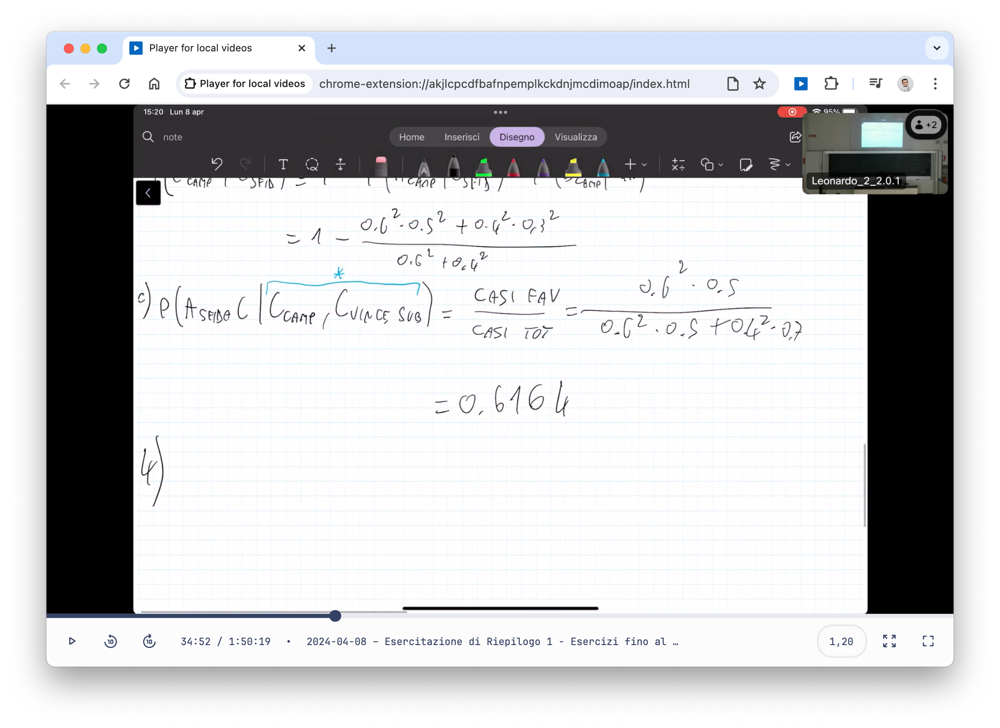

# Player for local videos

This a video player for local videos whose main features are:

- Light/dark theme (following system preferences)
- Continue watching from where you left off[^1]
- [Keyboard shortcuts](#keyboard-shortcuts)
- Global Media Controls integration
- Works offline

It can be installed as a [Chrome extension](https://chrome.google.com/webstore/detail/player-for-local-videos/jobmoeleihhccoboiljgojnjkejppiih) or as a [PWA](https://dltmtt.github.io/video-player/src).

[^1]: The video state is saved in the browser's local storage. If you clear your browser's data, the state will be lost. Saved state will be deleted upon video completion or for videos last played more than 30 days before.

## Background

I always download my lessons and watch them offline.
I generally speed them up above 2x, and QuickTime Player doesn't allow me to do that. I also didn't like writing down where I left off.
I tried a few video players, but they all had some issues or I didn't like their UI, so I decided to make my own as a browser extension.

## Usage

To use the extension, click on its tooltip icon or press <kbd>Alt</kbd>+<kbd>Shift</kbd>+<kbd>O</kbd>.
This shortcut can be changed by visiting <chrome://extensions/shortcuts> (you may need to copy and paste this URL in the address bar).

The page shown in the screenshots will open.
To open a video, drag and drop it there or click on the button.
If another video is opened, its state will be saved and the dragged video will be opened.

### Keyboard shortcuts

The following keyboard shortcuts are supported:

|                          Key                           | Action                |
| :----------------------------------------------------: | --------------------- |
|            <kbd>Space</kbd> <kbd>K</kbd>            | Toggle play/pause     |
|                      <kbd>S</kbd>                      | Slow down by 0.1x     |
|                      <kbd>D</kbd>                      | Speed up by 0.1x      |
| <kbd>Z</kbd> <kbd>&larr;</kbd> <kbd>&darr;</kbd> | Rewind 10 seconds     |
| <kbd>X</kbd> <kbd>&rarr;</kbd> <kbd>&uarr;</kbd> | Forward 10 seconds    |
|                      <kbd>R</kbd>                      | Reset default speed   |
|                      <kbd>T</kbd>                      | Toggle time/remaining |
|                      <kbd>A</kbd>                      | Set speed to 1.8x     |
|                      <kbd>M</kbd>                      | Toggle mute           |
|                      <kbd>C</kbd>                      | Toggle video zoom     |
|                      <kbd>P</kbd>                      | Toggle PiP            |
|            <kbd>F</kbd> <kbd>Enter</kbd>            | Toggle fullscreen     |
